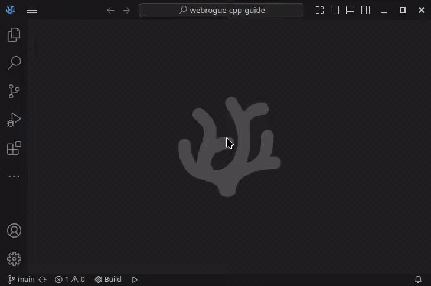
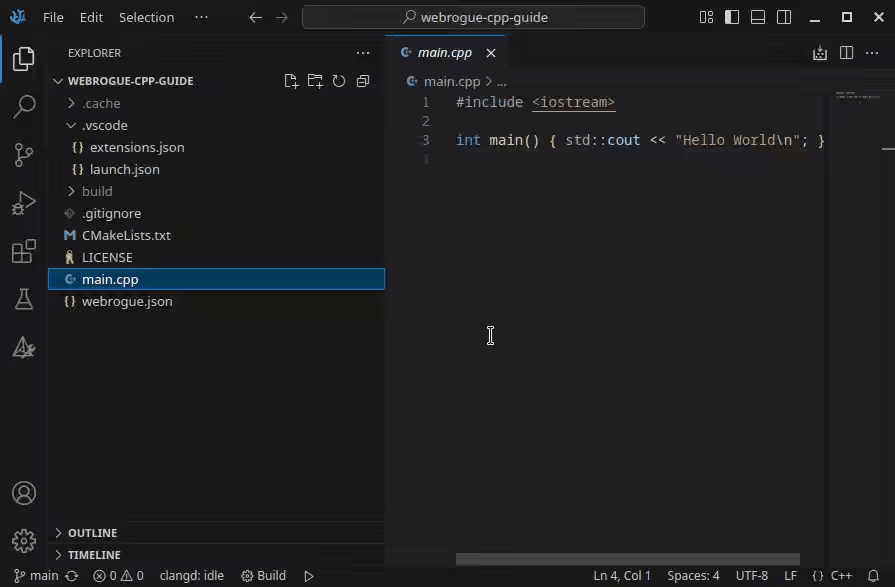

# C++/CMake/VSCode guide

This guide will show how to build a simple Webrogue application using C++, CMake, and Visual Studio Code.

## Installing CMake and Ninja

CMake also requires a generator program, usually Ninja.
```
# On Windows, you can install CMake and Ninja using WinGet
winget install Kitware.CMake
winget install Ninja-build.Ninja

# On MacOS you can use Homebrew
brew install cmake
brew install ninja

# On Ubuntu and Debian:
sudo apt-get install ninja-build cmake
```

## Installing Visual Studio Code and Extensions

Now let's install VSCode.
You can find instructions and download links on [official website](https://code.visualstudio.com/Download).

Then you will need the following VSCode extensions:
- [Webrogue](https://marketplace.visualstudio.com/items?itemName=webrogue.webrogue-vscode)
- [CMake Tools](https://marketplace.visualstudio.com/items?itemName=ms-vscode.cmake-tools)
- [clangd](https://marketplace.visualstudio.com/items?itemName=llvm-vs-code-extensions.vscode-clangd). Also press "Download" when "The 'clangd' language server was not..." message will appear.
- Optionally you can install [LLDB DAP](https://marketplace.visualstudio.com/items?itemName=llvm-vs-code-extensions.lldb-dap) or [CodeLLDB](https://marketplace.visualstudio.com/items?itemName=vadimcn.vscode-lldb). Webrogue is capable of using one of this extensions to avoid downloading "Fallback LLDB-DAP executable" component

## Installing Webrogue SDK

While Webrogue SDK can be installed manually, in this guide we will use Webrogue extension for VSCode to install it.

First of all, open command selection menu in VSCode.
It can be done by pressing Ctrl+Shift+P or navigating to Help -> Show All Commands.

Then search for `Webrogue: Install/Update components` command in this menu.
Start typing to filter commands.
Run this command, select "Webrogue SDK" component, press "Ok" and wait while Webrogue SDK installs.



On Windows, install Microsoft Visual C++ Redistributable if it is not already installed.
Download links can be found [there](https://learn.microsoft.com/en-us/cpp/windows/latest-supported-vc-redist#latest-microsoft-visual-c-redistributable-version).

## Creating and configuring "Hello World" C++ CMake project

Code of "Hello World" project can be found in [webrogue-cpp-guide repo](https://github.com/webrogue-runtime/webrogue-cpp-guide).

`CMakeLists.txt` file is CMake project configuration.
In this case configuration is minimal.
```
cmake_minimum_required(VERSION 3.22.0 FATAL_ERROR)

project(CppGuide)

add_executable(main main.cpp)
```

`main.cpp` file is the only source file in this C++ project.
```
#include <iostream>

int main() { std::cout << "Hello World\n"; }
```

`webrogue.json` defines Webrogue Application configuration.
Note a `"main": "build/main"`, where `build/main` is a path where cmake will (hopefully) place resulting WebAssembly executable.
```
{
    "name": "Webrogue C++ guide",
    "id": "webrogue.guides.CppGuide",
    "version": "0.1.0",
    "main": "build/main"
}
```

`.vscode/launch.json` file defines VSCode launch configuration.
```
{
    "version": "0.2.0",
    "configurations": [
        {
            "type": "webrogue",
            "request": "launch",
            "name": "Debug Webrogue Application",
            "program": "${workspaceRoot}/webrogue.json",
            "preLaunchTask": "CMake: build",
        }
    ]
}
```

Now we need to configure CMake project.
Run `CMake: Select a kit` command, than choose "Webrogue WASIp1-threads" and CMake will configure your project.
Alternatively you can select "Webrogue WASIp1-threads" under "configure" section in CMake tab.

Note that "Webrogue WASIp1-threads" may not appear in kit list.
It is likely to be a CMake extension bug.
Restart VSCode and if both Webrogue SDK component and CMake extension are installed then new kit will appear.



At this point we are ready to run our applications.
Just press F5 or use any other means to launch defined configuration.
Our program should print `Hello World` string to debug console or terminal.
Breakpoints should also work.

Read [next guide](02_sdl) to learn how to make simple graphical application, pack it into WRAPP file and build native apps.
