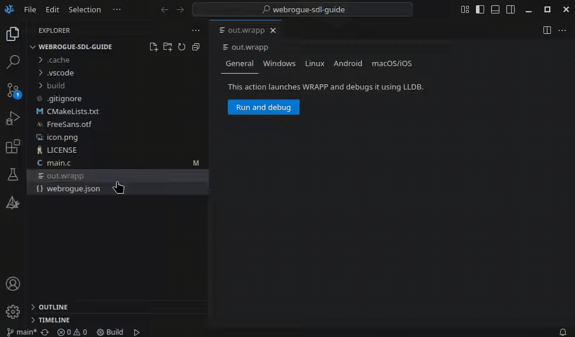

# C/SDL/packaging guide

This guide will show how to build a simple Webrogue application using SDL and package it for Windows, Linux and Android.
macOS/iOS support is coming soon!

It is assumed you are familiar with [previous guide](01_cpp).

## Changes from previous guide

Code of this project can be found in [webrogue-sdl-guide repo](https://github.com/webrogue-runtime/webrogue-sdl-guide).
Project is similar to one in previous guide, so it must be configured in the same way. 
But this project has a few changes.

First of all, now we are using C.
`main.cpp` file is renamed to `main.c`.
It's content is a common SDL project and contains nothing Webrogue-specific with the only exception: hardcoded path to font to load.

`CMakeLists.txt` becomes more complicated. 
All libraries specified in `target_link_libraries` command are packaged with Webrogue SDK, so there is no need to compile them from source.
```
cmake_minimum_required(VERSION 3.22.0 FATAL_ERROR)

project(SDLGuide)

find_package(SDL3 REQUIRED)
find_package(SDL3_ttf REQUIRED)

add_executable(main main.c)
target_link_libraries(main SDL3 SDL3_ttf freetype zlib png webroguegfx c++abi c++)
```

`webrogue.json` now includes information about resources and icon.
```
{
    "name": "simple",
    "id": "webrogue.examples.SDLGuide",
    "version": "0.1.0",
    "main": "build/main",
    "filesystem": {
        "resources": [
            {
                "mapped_path": "/app/FreeSans.otf",
                "real_path": "FreeSans.otf"
            }
        ]
    },
    "icons": {
        "normal": {
            "path": "icon.png",
            "inset": 0.22,
            "background": {
                "red": 1,
                "green": 1,
                "blue": 1
            }
        }
    }
}
```

We need a font to render text, and path to this font is hardcoded as `font_path = "/app/FreeSans.otf";`.
`FreeSans.otf` file is included in project.
Now let's take a closer look at this item in `webrogue.json`:
```
{
    "mapped_path": "/app/FreeSans.otf",
    "real_path": "FreeSans.otf"
}
```
There `real_path` is a path to `FreeSans.otf` file in our project, while `mapped_path` is a path our app "sees" this file.

Icon is required to package Webrogue applications for Android, macOS and iOS, so this project includes fancy 1024x1024 icon in `icon.png` file and the following record in `webrogue.json` (no hex colors, sorry):
```
"icons": {
    "normal": {
        "path": "icon.png",
        "inset": 0.22,
        "background": {
            "red": 1,
            "green": 1,
            "blue": 1
        }
    }
}
```

`.vscode/launch.json` file is exactly the same.

Configure and run this app like in previous guide.
This project must be built at least once to proceed.

## WRAPP

Now let's make a WRAPP file.
Ensure `build/main` file exists.
If not, build this project first.
Now run `Webrogue: Pack into WRAPP` command and select `./webrogue.json` file.
`out.wrapp` file should appear.
Select it and press `Run and debug` button in `General` tab.
Our application will launch in debug mode just like using VSCode config.
`out.wrapp` file contains not only compiled code, but also Webrogue application configuration, icons and resources like `/app/FreeSans.otf`.
You can move this file to different directory or even send it to machine with different OS, and Webrogue will still be able to run it.


## Windows and Linux

Building for both Windows and Linux can be done just in few clicks.
For windows, click `Build Windows app` in `Windows` tap, select destination path and wait a few seconds. .exe and .dll files will appear.
Resulting app doesn't includes resource files such as `FreeSans.otf` because they are embedded in .exe file.
For Linux, everything is the same for Linux with the only difference: Webrogue generates one file for Linux instead of three.



## Android

Building for Android is a bit more complicated because Java and Android SDK are currently required.
Signing key can be applied, but we will check `Use debug signature` checkbox to make things easier.
Now click `Build APK` button.
It will take some time for first build, but subsequent builds will take only a few seconds.

## macOS and iOS

macOS and iOS support is currently work-in-progress.
In any way you will need an Apple Developer account (paid) and macOS device or CI/CD with Xcode installed to support macOS and iOS.
